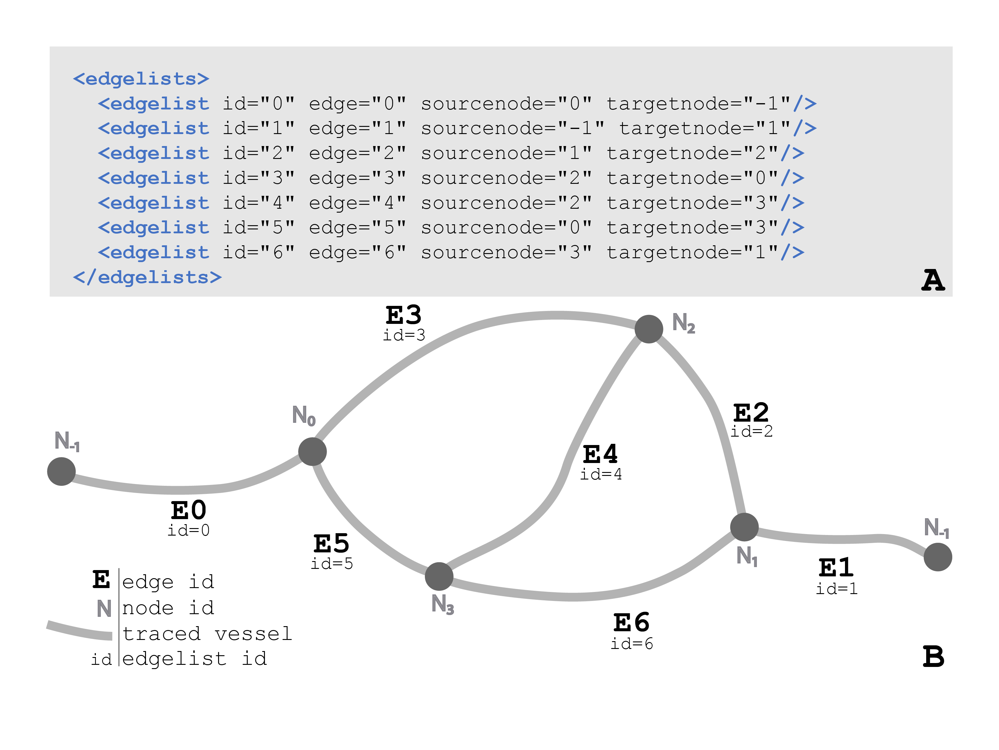

.. image:: Figures/MBFLogo_GrayScale.jpg
    :width: 108px
    :align: right
    :height: 70px
    :target: https://www.mbfbioscience.com/

Neuromorphological File Specification
=====================================

Version 4.0.0 [1]_

.. note::  For additional information, visit MBF Bioscience's user forum for the `Neuromorphological File Specification. <https://forums.mbfbioscience.com/c/neuromorphological-file-specification/34>`_ 

1. Definitions
--------------

1. Research Resource Identifier (RRID): a persistent and unique identifier for referencing a research resource.

2. Introduction to the Neuromorphological File Format
------------------------------------------------------

This specification describes the elements of the neuromorphological data file. The structures represented have been continually developed for over 30 years, balancing accurate 3D representation of microscopic structures with the efficiency for reading, writing, storing, and rendering the reconstruction data. The neuromorphological file format balances structure with flexibility by storing each modeled object as a unique data element, and providing mechanisms for grouping any number and type of data elements. File-level metadata is retained to provide detail on the origin of the sample, ensuring that the provenance of derivative data is tracked and that important source information is not separated from the corresponding data. The decision to implement each neuromorphological structure, from spines to varicosities, was influenced by top neuroscientists who sought to maintain a meaningful model and have the necessary analysis options for that entity. The file specification has evolved with academia and discovery, and will continue to be updated as needed to define added or modified data elements.

3. Neuromorphological File Contents
-----------------------------------

.. note::  The elements defined in the Neuromorpholocial File Specification (4.0) are only consistent with elements in XML data files with the <mbf version="4.0">. XML data files with prior version numbers may contain similar element structures, but will not exactly match this documentation. 

The neuromorphological file format is an Extensible Markup Language (XML) 1.0 (Fifth Edition) format and includes two organizational aspects, elements, and attributes [1]. These aspects are detailed in the XML specification provided by The World Wide Web Consortium (WC3). All neuromorphological data files have a header section that includes the file's introductory content followed by any traced data elements. Traced data elements are representations of a diverse range of neuromorphological structures found in microscopy image data.

 
.. code-block:: xml

	<?xml version="1.0" encoding="ISO-8859-1"?>
	<mbf version="4.0" appname="ApplicationName" appversion="YYYY.V.M" apprrid="SCR_xxxxx" insrrid="SCR_xxxxx">
	  <description></description>
	  <filefacts></filefacts>
	  <sparcdata></sparcdata>
	  <property name="TimePointManager"></property>
	  <images></images>
	  <thumbnail cols="64" rows="64"></thumbnail>
	
	  TRACING DATA
	
	</mbf>
	
*Figure 1 A Neuromorphological data file.  The header elements are displayed in green. All MBF tracing data is a nested element of the <mbf> element and is represented above with the comment, TRACING DATA.*

3.1 Coordinate Space 
^^^^^^^^^^^^^^^^^^^^
The coordinate space for all neuromorphological data files is a three-dimensional space and all coordinates and measurements are in micrometer units (µm). The origin point of the coordinate system is (0, 0, and 0).

*Figure 2 demonstrates the 3D coordinate space with an origin point of (0, 0, and 0). The gray planes represent a 3D image volume with an image location coordinate, coord: (x, y, and z). Note the direction of the Z-axis. The most positive image plane of the 3D volume is image plane 1. The following image planes are in the same X and Y location, but their z location changes incrementally based on the z scaling. The units of this coordinate space are in micrometers (µm).*

4. Header Elements 
-------------------
The first line of all neuromorphological data files is always the XML declaration element. It contains two attributes, version and encoding, that define the structure and storage units of the neuromorphological file format.

.. code-block:: xml

    <?xml version="1.0" encoding="ISO-8859-1"?>

*Figure 3 The XML document declaration element, attributes, and values as they apear in the data file.*

+------------+------------+--------------------------------------------------+
|Element     |Attributes  | Description                                      |
+============+============+==================================================+
| <?>                     | The XML declaration element informs the structure| 
|                         | and storage units of the document.               |
+------------+------------+--------------------------------------------------+
|            | version	  | The XML document specification version number.   | 
|            |            | For all data files created with MBF              |
|            |            | Bioscience software, this value will equal "1.0" |
|            |            | indicating the version of the XML specification  |
|            |            | [1].                                             |
+            +------------+--------------------------------------------------+
|            | encoding	  | Identifies the character format in the file.     |
|            |            | This value will equal "ISO-8859-1" for all       |
|            |            | data files created with MBF Bioscience           |
|            |            | software, implying single-byte encoding [2].     |
+------------+------------+--------------------------------------------------+

*Table 1 The XML declaration element, attributes, and descriptions for all fields.*

The remainder of the data file is embedded within the <mbf> element, including file header information and the elements that comprise the tracing data used to model neuronal morphology and surrounding anatomies. The closing </mbf> is the last line of all neuromorphological data files.

.. code-block:: xml

    <mbf version= 4.0 appname="ApplicationName" appversion="YYYY.V.M" apprrid="SCR_xxxxx" insrrid="SCR_xxxxx">
      ⋮
    </mbf>

*Figure 4 The <mbf> element, attributes, and values as they apear in the data file. The appversion for all MBF Bioscience software is reported with the year, version, and minor version (YYYY.V.M). The virtical elipses between the attributes of the <mbf> elements  and the </mbf> end tag is used as shorthand to indicate there are additional child elements of the <mbf> element that are not detailed in this figure.*

The following attributes reside directly within the <mbf> element:

+------------+------------+--------------------------------------------------+
|Element     |Attributes  | Description                                      |
+============+============+==================================================+
| <mbf>                   | All neuromorphological data is contained within  | 
|                         | the <mbf> element.                               |
+------------+------------+--------------------------------------------------+
|            | version	  | Reports the version number of the                |
|            |            | neuromorphological data file structure. It is    |
|            |            | necessary to define the expected data structure  |
|            |            | for the document that follows to ensure older    |
|            |            | data versions are supported. The current         |
|            |            | neuromorphological data file version number is   |
|            |            | 4.0.                                             |
+            +------------+--------------------------------------------------+
|            | appname	  | The name of the software that generated the      |
|            |            | neuromorphological data file.                    |
+            +------------+--------------------------------------------------+
|            | appversion | The version of the software that generated the   |
|            |            | neuromorphological data file. MBF Bioscience     |
|            |            | software versions are reported with the year,    |
|            |            | version, and minor version (YYYY.V.M).           |
+            +------------+--------------------------------------------------+
|            | apprrid    | The Research Resource Identifier (RRID) for the  |
|            |            | software application.                            |
+            +------------+--------------------------------------------------+
|            | insrrid    | Institution Research Resource Identifier (RRID). |
+------------+------------+--------------------------------------------------+

*Table 2 The <mbf> element, attributes, and descriptions for all fields.*

The remaining portion of the header information is described in detail below. File header information includes necessary metadata that helps to describe the data included in the neuromorphological file.

4.1 <description>
^^^^^^^^^^^^^^^^^

The <description> element is a string of user optional text describing the contents of the data file. The format of the text is character data indicated by the CDATA section, used to differentiate the text block from markup.

.. code-block:: xml

    <description><![CDATA[Example description of image segmentation file]]></description>

*Figure 5 The <description> element contains the CDATA start section <![CDATA[ and CDATA end section ]] to indicate a large string of text that is not a data element.*

4.2 <filefacts>
^^^^^^^^^^^^^^^

The <filefacts> element stores sequentially ordered serial Z sections for the data file that correspond to physically or virtually sectioned histologic tissue. If no sections have been created for a data file, the only child element of the <filefacts> is the <sectionmanager>. In this case, the values of the <sectionmanager> attributes indicate there have been no sections created and the child element should be disregarded.

.. code-block:: xml

    <filefacts>
	  <sectionmanager currentsection="" sectioninterval="0" startingsection="0"/>
    </filefacts>

*Figure 6 displays the <filefacts> of a data file with no sections. Note the current section has no value, the sectioninterval value is “0”, and the startingsection value is “0”.*

If serial Z sections have been created for the data file, this child element contains meaningful parameters about the sections. Child <section> elements for each Z section are stored in the <filefacts> element.

.. code-block:: xml

	<filefacts>
	   <section sid="S1" name="Section N0" top="z.zz" cutthickness="n.nn" mountedthickness="n.nn"/>
	   <section sid="S2" name="Section N1" top="z.zz" cutthickness="n.nn" mountedthickness="n.nn"/>
	   <section sid="S3" name="Section N2" top="z.zz" cutthickness="n.nn" mountedthickness="n.nn"/>
	   <sectionmanager currentsection="Section Nx" sectioninterval="i" startingsection="N0"/>
	</filefacts>

*Figure 7 The <filefacts> of a data file with serial sections. Each section in the data file has a corresponding <section> element. The attributes of the <sectionmanager> element are now significant values.*

All child elements and attributes of the <filefacts> are defined in Table 3. 

+------------+------------------+--------------------------------------------------+
|Element     |Attributes        | Description                                      |
+============+==================+==================================================+
| <filefacts>                   | Stores sequentially ordered serial Z sections    |
|                               | for the data file that corresponds physically or |
|                               | virtually sectioned histologic tissue.           |
+------------+------------------+--------------------------------------------------+
|    <section>                  | Each serial Z section generated receives a       |
|                               | <section> element that includes information for  |
|                               | the unique section.                              |
+------------+------------------+--------------------------------------------------+
|            | sid              | A sequential identifier for each section         |
|            |                  | (S1, S2, S3… SN).                                |
+            +------------------+--------------------------------------------------+
|            | name             | Default names for each section are “Section N”,  |
|            |                  | where N is incremented by the sectioninterval.   |
|            |                  | The names can be user modified.                  |
+            +------------------+--------------------------------------------------+
|            | top              | The highest Z value (µm) of the serial section.  |
+            +------------------+--------------------------------------------------+
|            | cutthickness     | Equal to the distance from one section to the    |
|            |                  | next (µm).                                       |
+            +------------------+--------------------------------------------------+
|            | mountedthickness | Used to represent the physical thickness (µm) of | 
|            |                  | the tissue on the slide following section        |
|            |                  | processing and the associated shrinkage.         |
+------------+------------------+--------------------------------------------------+
|     <sectionmanager>          | Contains parameters about the sections created   |
|                               | for a data file.                                 |
+------------+------------------+--------------------------------------------------+
|            | currentsection   | The section of the data file the user was on when| 
|            |                  | the document was last saved.                     |
+            +------------------+--------------------------------------------------+
|            | sectioninterval  | Indicates the interval of the section names. A   |
|            |                  | section interval i with a startingsection at N0  |
|            |                  | would produce section names: Section N0, Section |
|            |                  | N0+i, Section N0+2i, Section N0+3i ... Section   |
|            |                  | N0+(n)i where n is the total number of sections. |
+            +------------------+--------------------------------------------------+
|            | startingsection  | The first section in the interval list.          |
+------------+------------------+--------------------------------------------------+

*Table 3 The <filefacts> element, its child elements, attributes, and descriptions for all fields.*

4.3 <sparcdata>
^^^^^^^^^^^^^^^
The <sparcdata> element stores additional subject and annotation metadata. This information allows neuromorphological data files to be queried by species, subject ID, sex, age, and organ of the image sample origin. 

MBF products interface with an external database, Scicrunch that maintains lists of anatomical terms separated by organ, species, and atlas/parcellation scheme. Each anatomy term is associated with a unique identifier and is approved by a team of anatomical experts. The <sparcdata> element informs the species, subject, sex, and age of the image sample segmented along with the exact anatomical list used to segment the image.  

.. code-block:: xml

    <sparcdata>
      <subject species="http://purl.obolibrary.org/obo/NCBITaxon_XXXXXX" subjectid="SUBJECT_001" sex="Male" age="14 Weeks"/>
      <atlas organ="Brain" label="Allen Mouse Brain Atlas Terminology" rootid="http://purl.org/sig/ont/fma/fmaXXXX"/>
    </sparcdata>

*Figure 8 A neuromorphological data file related to a microscopy image sample from a 14-week old male mouse brain delineated using anatomical terminology from the Allen Mouse Brain Atlas [3]. The species and atlas rootid provide URL links to the term lists origin.*

The <sparcdata> child elements and their attributes are detailed in Table 4.

+------------+------------+--------------------------------------------------+
|Element     |Attributes  | Description                                      |
+============+============+==================================================+
| <sparcdata>             |  Additional subject and annotation metadata.     |
+------------+------------+--------------------------------------------------+
|    <subject>            | Metadata describing the subject from which the   |
|                         | image sample originated.                         |
+------------+------------+--------------------------------------------------+
|            | species    | The subject's species is reported using the NCBI |
|            |            | Taxon identifier to ensure databases can query   |
|            |            | this information and relate synonyms to the ID.  |
+            +------------+--------------------------------------------------+
|            | subjectid  | A user-defined subject identifier based on the   |
|            |            | animal sample naming scheme that the researcher  |
|            |            | prefers.                                         |
+            +------------+--------------------------------------------------+
|            | sex        | Subject sex can either be reported as male or    |
|            |            | female. Can be set to “blind to condition” while |
|            |            | data collection is in progress if this is part of|
|            |            | the experimental design.                         |
+            +------------+--------------------------------------------------+
|            | age        | Age is a user-defined value and can be reported  | 
|            |            | in a unit of either days, weeks, months, or      | 
|            |            | years. Can be set to “blind to condition” while  | 
|            |            | data collection is in progress if this is part of|  
|            |            | the experimental design.                         | 
+------------+------------+--------------------------------------------------+
|     <atlas>             | Defines the anatomy terminology list used to     |
|                         | annotate an image.                               |
+------------+------------+--------------------------------------------------+
|            | organ      | The organ attribute indicates which subset of    |
|            |            | terms was used to annotate, grouped by major     |
|            |            | organ.                                           |
+            +------------+--------------------------------------------------+
|            | label      | Indicates the parcellation scheme or atlas.      |
+            +------------+--------------------------------------------------+
|            | rootid     | A URL link to the term lists origin.             |
+------------+------------+--------------------------------------------------+

*Table 4 The <sparcdata> element, its child elements, attributes, and descriptions for all fields.*

4.4 <property name="TimePointManager">
^^^^^^^^^^^^^^^^^^^^^^^^^^^^^^^^^^^^^^

The <property> element named “TimePointManager” will always be present in the neuromorphological data files, however, it is not used at this time. The element can be disregarded.

4.5 <images>
^^^^^^^^^^^^

Raw image data is not saved within neuromorphological data files, rather they are linked with a file location and name and other information about the image.

The <images> element in the header can contain one or many <image> elements enabling the neuromorphological data file to be associated with any number of source images. The images can be either 2D (a single image plane) or 3D (multiple image planes from a single file or multiple files). Image data can be combined in several ways inside the neuromorphological data file. The simplest is the single 3D or 2D image file. See an example in Figure 9. 

.. code-block:: xml

    <images>
      <image>
        <filename>\\FilePath\ImageName</filename>
        <channels merge="no">
          <channel id="red" source="none"/>
          <channel id="green" source="none"/>
          <channel id="blue" source="none"/>
        </channels>
        <scale x="x.xxx" y="y.yyy"/>
        <coord x="x.xxx" y="y.yyy" z="z.zzz"/>
        <zspacing z="z.zzz" slices="n"/>
      </image>
    </images>

*Figure 9 An <images> element with only one image associated with the data file.*

Within each <image> element, five nested elements provide details pertaining to that image(s).

+-----------+-------------+-------------------------------------------------------+
|**Element**|**Attribute**| **Description**                                       |
+===========+=============+=======================================================+
| <image>                 | The <images> element can contain one or many nested   |
|                         | <image> child elements. This enables the              |
|                         | neuromorphological data file to be associated with any| 
|                         | number of source images.                              |
+-----------+-------------+-------------------------------------------------------+
|    <filename>           | The windows file path and name of the associated      |
|                         | image.                                                |
+-----------+-------------+-------------------------------------------------------+
|    <channels>           | Defines the colors of each channel if the channels are|
|                         | merged from separate image files.                     |
+-----------+-------------+-------------------------------------------------------+
|           | merge       | The value of the merge attribute will be “yes” if the |
|           |             | channels have been merged from separate image files   |
|           |             | and “no” if they have not.                            |
+-----------+-------------+-------------------------------------------------------+
|    <channel>            | Three <channel> child elements for the color channels,|
|                         | red, green, and blue are always reported. Their unique|
|                         | id and source attributes define the channel color and |
|                         | source.                                               |
+-----------+-------------+-------------------------------------------------------+
|           | id          | Identifies the pseudocolor of the color channel.      |
+-----------+-------------+-------------------------------------------------------+
|           | source      | Records the selected color channel number from the    |
|           |             | corresponding source image in the <filename> element. |
|           |             | Starts at 0.                                          |
+-----------+-------------+-------------------------------------------------------+
|    <scale>              | The size of each pixel in x and y.                    |
+-----------+-------------+-------------------------------------------------------+
|           | x           | The X scaling of the image in µm/pixel.               |
+-----------+-------------+-------------------------------------------------------+
|           | y           | The Y scaling of the image in µm/pixel.               |
+-----------+-------------+-------------------------------------------------------+
|    <coord>              | Reports the attributes and values for the X, Y, and Z |
|                         | coordinates of the upper, left-hand corner of the     |
|                         | image.                                                |
+-----------+-------------+-------------------------------------------------------+
|           | x           | The X location of the image origin (µm).              |
+-----------+-------------+-------------------------------------------------------+
|           | y           | The Y location of the image origin (µm).              |
+-----------+-------------+-------------------------------------------------------+
|           | z           | The Z location of the image origin (µm).              |
+-----------+-------------+-------------------------------------------------------+
|    <zspacing>           | The zspacing element uses the z and slices attributes |
|                         | to describe the relationship of image planes that     |
|                         | compile into a 3D image.                              |
+-----------+-------------+-------------------------------------------------------+
|           | z           | Spacing between each image plane in micrometer units. |
+-----------+-------------+-------------------------------------------------------+
|           | slices      | The total number of image planes in a 3D image.       |
+-----------+-------------+-------------------------------------------------------+

*Table 5 The <image> element, its child elements, attributes, and descriptions for all fields.*

A neuromorphological data file with multiple, distinct images associated to the same file may include many <image> child elements in the <images> element. Each image will have its own set of child elements and attributes.

.. code-block:: xml

    <images>
      <image>
        <filename>\\FilePath\Image[1]</filename>
        <channels merge="no"></channels>
        <scale/>
        <coord/>
        <zspacing/>
      </image>
      <image>
        <filename>\\FilePath\Image[2]</filename>
        <channels merge="no"></channels>
        <scale/>
        <coord/>
        <zspacing/>
      </image>
    </images>

*Figure 10 An <images> element with multiple distinct images associated with the same data file. Note there are two separate <image> child elements within the <images> element. For concicity, the attributes of each child elements of each <image> have been excluded from the figure, but follow the same structure as see in Figure 9.*

A 3D volume can be made up of many 2D image planes. These volumes are recorded within the neuromorphological data file with one <image> child element and an ordered list of <filename> children elements pointing to the location and file name for each image plane. Each 2D image plane is sequentially loaded from the list into a 3D image volume. The scale is consistent for every image plane. The <coord> reports the X, Y, and Z coordinates of the upper, left-hand corner of the first image plane. The distance between image planes and the number of slices is kept constant for the entire image volume.

.. code-block:: xml

    <images>
	  <image>
	    <filename>FilePath\Image[1]</filename>
		<filename>FilePath\Image[2]</filename>
		<filename>FilePath\Image[3]</filename>
		<filename>FilePath\Image[4]</filename>
		⋮
		<filename>FilePath\Image[N]</filename>
		<channels merge="no"></channels>
		<scale/>
		<coord/>
		<zspacing z="z.zzz" slices="N"/>
	  </image>
	</images>

*Figure 11 A data file with many 2D image planes that make up a 3D image volume. The file path and image name for each 2D image are reported sequentially in the same <image> child element. In the <zspacing> element, the distance between each 2D image is reported, z=“z.zz”. The number of 2D image planes that construct the 3D volume will equal the total number of slices=”N”. Other image elements have been shortened to emphasize the important differences in this image organization. The <channels>, <scale>, and <coord> attributes are still included in these data files.*

A multi-channel microscopy image can be generated by merging 2 or 3 source images that make up the image color channels. If the images are merged to create a multi-channel image, the <channels> merge attribute will have a value of “yes”. There will always be three <filename> elements that sequentially correspond to the <channel> elements (i.e. <filename>1 will always correspond to the red <channel> element). The <channel> id attribute reports the pseudocolor of the color channel (red, green, or blue). The source attribute defines the image channel number from the source image starting at 0. If no image is selected for a <channel> element, the <filename> will remain but no image path or name is reported and the <channel> source value will equal “none”.

.. code-block:: xml

    <images>
	  <image>
	    <filename>FilePath\Image[1]</filename>
	    <filename>FilePath\Image[2]</filename>
	    <filename>FilePath\Image[1]</filename>
	    <channels merge="yes">
	      <channel id="red" source="0"/>
	      <channel id="green" source="2"/>
	      <channel id="blue" source="1"/>
	    </channels>
	    <scale/>
	    <coord/>
	    <zspacing/>
	  </image>
	</images>

*Figure 12 A data file with multiple images merged into one multi-channel image. The first channel of Image[1], source=”0”, is displayed in MBF Bioscience software as red. The third channel of Image[2], source=”2”, is displayed in MBF Bioscience software as green. The second channel of Image[1], source”1”, is displayed in MBF Bioscience software as blue.*

4.6 <thumbnail>
^^^^^^^^^^^^^^^

The <thumbnail> element stores data to create a small graphical (64x64) representation of the tracing data. Each of the 64 <thumbnail-line> elements represent one row in the thumbnail. The 64 pixels in each row are represented with a 3-byte hexadecimal (RRGGBB) alphanumeric character.

.. code-block:: xml

    <thumbnail cols="64" rows="64">
       <thumbnail-line>0xRR1GG1BB1RR2GG2BB2...RR64GG64BB64</thumbnail-line>
       <thumbnail-line></thumbnail-line>
        ⋮
    </thumbnail>

*Figure 13 The <thumbnail> element, child elements, attributes, and values as they apear in the data file. The cols and rows attributes define the pixel dimentions of the 2D traced data thumbnail. A <thumbnail-line> child elements is present for every row of the <thumbnail>, but it is abbriviated here for concision. There are RRGGBB characters for each column of the data file. In the figure, the subscript numbers indicate the column number for the character.*

5.Trace Data
------------

The traced data elements include all data models of neuromorphological structures and additional image annotations. A data file will not necessarily contain all traced data elements. Typically a data file will include more than one of a single traced element in a data file. For example, there may be many contours of the same contour type and/or of a different contour type depending on what has been segmented. Figure 14 demonstrates the general organization of all trace data elements with a neuromorphological data file.

.. code-block:: xml

    <?xml version="1.0" encoding="ISO-8859-1"?>
    <mbf>
    
      HEADER ELEMENTS
    
      <contour></contour> 
      <marker></marker>
      <arrow></arrow>   
      <tree> 
        <spine></spine>  
        <varicosity></varicosity> 
      </tree> 
      <vessel></vessel>  
      <text></text>  
      <scalebar></scalebar>  
    </mbf>

*Figure 14 Demonstrates the organization of all traced data elements in the Neuromorphological file format. All traced data and header elements are child elements of  the <mbf> element. The <spine> and <varicosity> elements are child elements of the <tree>. The order and number of these elements within the parent <tree> may vary. The header elements are represented with the HEADER ELEMENTS comment and do not actually appear this way in the data file. They have been abbreviated to focus attention on the traced data elements.*

5.1 Common Components
^^^^^^^^^^^^^^^^^^^^^

5.1.1 Color
###########

The color attribute is seen in many neuromorphological file elements. It uses a 3-byte hexadecimal (RRGGBB) alphanumeric character to represent the color of traced structures.

5.1.2 <point>
#############

The nested element <point> is included in several elements of the neuromorphological  file format to denote a point at a distinct X, Y, and Z location with a 3D micrometer coordinate space. The <point> element also includes a diameter value indicating the thickness at that point. These coordinates are represented using the corresponding x, y, z, and d attributes and are always in micrometer units.

.. code-block:: xml

    <point x="x.xx" y="y.yy" z="z.zz" d="d.dd"/>

*Figure 15 The <point> element, attributes, and values as they apear in the data file.*

5.1.3 <property name="Channel">
###############################

The “Channel” <property> indicates the image color channel used to trace an object. If a detection is performed on only one of the image color channels, then that image channel is reported for the detected data element. If the detection is performed on two or more color channels, the <property name= “Channel”> element will not be written for that structure. If the image is monochrome, the <property name= “Channel”> element will not be written for any structure. Child elements are expected to be detected in the same color channel as their parent structure. For example, a <branch>, <spine>, or <varicosity> is expected to be detected in the same color channel as the associated <tree>.

.. code-block:: xml
    
	Line#  Neuromorphological Data File
	[0]    <property name="Channel">
	[1]    <n>1</n>
	[2]    <n>0</n>
	[3]    <c>#RRGGBB</c></property>

*Figure 16 The <property name=”Channel” > element, attributes, and values. The line numbers and return spaces present in the figure above were added for clarity and do not exist in the data file structure. The line numbers correspond with the numbered values in Table 6. The “Channel” values actually appear as a string.*

+--------------+--------+----------------+------------------------------+
|**<property>**|**Line**|**Value**       |**Description**               |
|              |**#**   |                |                              |
+==============+========+================+==============================+
| name=”Channel”                         | Contains three values that   |
|                                        | describe the channel an      |
|                                        | element was detected in.     |
+--------------+--------+----------------+------------------------------+
|              | [1]    | version        | The Channel child element’s  |
|              |        |                | format version.              |
+--------------+--------+----------------+------------------------------+
|              | [2]    | channel number | Indicates the color channel  |
|              |        |                | number of the source image a |
|              |        |                | trace element was detected in|
|              |        |                | starting at 0.               |
+--------------+--------+----------------+------------------------------+
|              | [3]    | channel color  | The color of this channel is |
|              |        |                | reported as a hex adecimal   |
|              |        |                | value.                       |
+--------------+--------+----------------+------------------------------+

*Table 6 The <property name=”Channel”> element, values, and descriptions for all fields.*

5.1.4 <property name="Set">
###########################

The <property> named “Set” can be found in any trace data element. The <property> is used to name and group one or many trace data elements. These elements can either be the same type (ex. just <tree> elements) or different types (ex. <marker>, <tree>, and <contour> elements). A set has one value that is a text string indicating the name of that set. An element can be associated with multiple “Set” properties.

.. code-block:: xml

    <contour name="Soma 1" color="#FFFF00" closed="true" shape="Contour">
      <property name="GUID"></property>
      <property name="FillDensity"></property>
      <property name="Set"><s>EXAMPLE SET NAME</s></property>
      <point x="x.xx" y="y.yy" z="z.zz" d="d.dd"/>
    </contour>

*Figure 17 An example of the  “Set”  <property> and its text string value, <s>EXAMPLE SET NAME</s>. In this example, the <contour> element “Soma 1” has been placed into a set called EXAMPLE SET NAME. The <contour> includes the child  element <property name=”Set”> and the unique set name to indicate it belongs to the group of trace elements.*

5.2 <marker>
^^^^^^^^^^^^

The neuromorphological file format uses the <marker> element to represent single points in the data file. The only child element of the <marker> is the <point> element indicating the X, Y, and Z, location of the <marker> and the diameter of the point. Each <point> represents the center of one marker of specific marker type. A <marker> type can hold one or many <point> elements, each representing an independent marked location.  

.. code-block:: xml

    <marker type="Plus" color="#RRGGBB" name="ExampleName" varicosity="false">
      <property name="Channel"></property>
      <point x="x.xx" y="y.yy" z="z.zz" d="d.dd"/>
      <point x="x.xx" y="y.yy" z="z.zz" d="d.dd"/>
       ⋮
    </marker>

*Figure 18 The <marker> element, child elements, attributes, and values as they apear in the data file. This <marker> type is Plus and is linked to a + symobol.*

Each <marker> attribute, including type, color, name, and varicosity, is defined in Table 7.

+-------------+--------------------------+--------------------------+
| **Element** | **Attribute**            | **Description**          |
+=============+==========================+==========================+
| <marker>                               | A symbol placed in a     |
|                                        | single point location    |
|                                        | (x, y, and z).           |
+-------------+--------------------------+--------------------------+
|             | type                     | A text field that        |
|             |                          | describes the symbol     |
|             |                          | shape used to mark a     |
|             |                          | point.                   |
+-------------+--------------------------+--------------------------+
|             | color                    | Indicates the marker's   |
|             |                          | symbol color,            |
|             |                          | represented with a       |
|             |                          | hexadecimal RGB value.   |
+-------------+--------------------------+--------------------------+
|             | name                     | A user-defined name.     |
+-------------+--------------------------+--------------------------+
|             | varicosity               | This value will be set   |
|             |                          | to true if the marker is |
|             |                          | used to mark a           |
|             |                          | varicosity, otherwise,   |
|             |                          | the value is set to      |
|             |                          | false to indicate a      |
|             |                          | typical marker element.  |
+-------------+--------------------------+--------------------------+

*Table 7 The <marker> element, child elements, and all attributes. Each data component includes a corresponding description.*

Makers can be associated with other traced objects including <contour> and <tree> elements. This section highlights the change in location of the <marker> when it is associated with another element. The <marker> becomes a child element to the parent <contour> or <tree> it is associated with and is always placed after the last <point> of the parent element.

.. code-block:: xml

    <contour name="ContourName" color="#RRGGBB" closed="true" shape="Contour">
      <property name="FillDensity"></property>
      <point x="x.xx" y="y.yy" z="z.zz" d="d.dd"/>
      <point x="x.xx" y="y.yy" z="z.zz" d="d.dd"/>
      <marker type="Circle1" color="#RRBBGG" name="ExampleName" varicosity="false">
        <point x="x.xx" y="y.yy" z="z.zz" d="d.dd"/>
      </marker>
    </contour>

*Figure 19 A <contour> element with a child <marker> element representing an association of the two elements.*

5.3 Punctum
^^^^^^^^^^^
Punctum volumes are represented with an extended version of the <marker> element. They contain all of the <marker> attributes, which are detailed in the <marker> section above. All punctum <marker> elements have the value “Punctum” for the name attribute differentiating them from a typical <marker> element. Similar to <marker> elements, punctum also include one <point> child element. This <point> describes the punctum’s center of mass, reporting an X, Y, and Z coordinate along with a diameter.

.. code-block:: xml

    <marker type="OpenCircle" color="#RRGGBB" name="Punctum" varicosity="false">
      <property name="Channel"></property>
      <property name="Punctum"><n></n><n></n>...</property>
      <property name="VolumeRLE"></property>
      <point x="x.xx" y="y.yy" z="z.zz" d="d.dd"/>
    </marker>

*Figure 20 A “Punctum” represented with the <marker> element. In this figure, the <property name=” “> child elements exclude or abbrivate values for concision.*

The punctum <marker> element also includes three <property> elements named “Channel”, “Punctum”, and “VolumeRLE”. The “Channel” is defined in the common components section of the document. “Punctum” and “VolumeRLE” are described in detail below.

.. code-block:: xml

    Line#    Neuromorphological Data File
    [0]      <property name="Punctum">
    [1]      <n>4</n>
    [2]      <n>n.nnnnn</n>
    [3]      <n>n.nnnnn</n>
    [4]      <n>n.nnnnn</n>
    [5]      <n>n</n>
    [6]      <n>0</n>
    [7]      <n>n.nnnnn</n>
    [8]      <n>0</n>
    [9]      <n>2</n>
    [10]     <n>0</n>
    [11]     <n>0</n></property>

*Figure 21 The “Punctum” <property> includes a string of 11 numbers. The line numbers and return spaces present in the figure above were added for clarity and do not exist in the data file structure. The line numbers correspond with the numbered values in Table 8. The “Punctum” values actually appear as a string as demonstrated in the “Punctum” <property> of Figure 20.*

+----------------+------------+-----------------+-----------------+
| **<property>** | **Line #** | **Value**       | **Description** |
+================+============+=================+=================+
| name=”Punctum”                                | A string of     |
|                                               | numbers that    |
|                                               | report the      |
|                                               | puncta metrics. |
+----------------+------------+-----------------+-----------------+
|                | [1]        | version         | The <property   |
|                |            |                 | name=“Punctum”> |
|                |            |                 | format version. |
+----------------+------------+-----------------+-----------------+
|                | [2]        | spread          | Distance of the |
|                |            |                 | farthest voxel  |
|                |            |                 | from the center |
|                |            |                 | of mass of the  |
|                |            |                 | punctum.        |
+----------------+------------+-----------------+-----------------+
|                | [3]        | mean luminance  | The average     |
|                |            |                 | luminance of    |
|                |            |                 | all the voxels  |
|                |            |                 | of the punctum. |
+----------------+------------+-----------------+-----------------+
|                | [4]        | surface area    | The surface     |
|                |            |                 | area of the     |
|                |            |                 | mesh for the    |
|                |            |                 | detected        |
|                |            |                 | punctum.        |
+----------------+------------+-----------------+-----------------+
|                | [5]        | voxel count     | Total number of |
|                |            |                 | voxels that     |
|                |            |                 | make up the     |
|                |            |                 | punctum.        |
+----------------+------------+-----------------+-----------------+
|                | [6]        | 2D flag         | Equals 0 if the |
|                |            |                 | punctum was     |
|                |            |                 | detected in 3D  |
|                |            |                 | and 1 if the    |
|                |            |                 | punctum was     |
|                |            |                 | detected in 2D. |
+----------------+------------+-----------------+-----------------+
|                | [7]        | volume          | Volume of the   |
|                |            |                 | puncta in cubic |
|                |            |                 | micrometers.    |
+----------------+------------+-----------------+-----------------+
|                | [8]        | type            | Reserved        |
|                |            |                 | integer value.  |
|                |            |                 | It may be used  |
|                |            |                 | as a custom     |
|                |            |                 | punctum type    |
|                |            |                 | modifier.       |
+----------------+------------+-----------------+-----------------+
|                | [9]        | location        | Indicates       |
|                |            |                 | punctum's       |
|                |            |                 | colocalization  |
|                |            |                 | with            |
|                |            |                 | user-specified  |
|                |            |                 | structure:      |
|                |            |                 | 0=colocalized,  |
|                |            |                 | 1=proximal,     |
|                |            |                 | 2=distal.       |
+----------------+------------+-----------------+-----------------+
|                | [10]       | colocalized     | A portion of    |
|                |            | fraction        | the volume that |
|                |            |                 | is colocalized  |
|                |            |                 | with a          |
|                |            |                 | user-specified  |
|                |            |                 | structure.      |
+----------------+------------+-----------------+-----------------+
|                | [11]       | proximal        | A portion of    |
|                |            | fraction        | the volume that |
|                |            |                 | is proximal to  |
|                |            |                 | a               |
|                |            |                 | user-specified  |
|                |            |                 | structure.      |
+----------------+------------+-----------------+-----------------+

*Table 8 The <property name=”Punctum”> element, its values, and a descriptions for all fields. The Line # column corresponds to the line numbers in Figure 21.*

The final <property>, “VolumeRLE”, defines a cuboid enclosing the detected punctum volume. The “VolumeRLE” values are detailed in Table 9. 

.. code-block:: xml

    <property name="VolumeRLE"><s>x.xx y.yy z.zz VT Vx Vy Vz x.x y.y z.z B1 F1 B2 F2 ... Bn Fn</s></property>

*Figure 22 The “VolumeRLE” <property> includes a string of numbers that describe the voxels of the punctum’s detection cuboid. The variables in the figure correspond with one number, each defined in Table 9. The first two pairs of background and foreground values (B1, F1, B2, F2) are listed. The remaining background and foreground values are abbreviated in the figure for concision using the ellipsis. The final pair of background and foreground values (Bn, Fn) are the last values in the string.*

+----------------+--------------+-----------+------------------------------+
| **<property>** | **Figure**   | **Value** | **Description**              |
|                | **Variable** |           |                              |
+================+==============+===========+==============================+
| name=”VolumeRLE”                          | A list of the foreground and |
|                                           | background voxels that       |
|                                           | construct a cuboid enclosing |
|                                           | the punctum volume. The      |
|                                           | foreground voxels are the    |
|                                           | voxels within the cuboid     |
|                                           | with a high luminance that   |
|                                           | construct the punctum. In    |
|                                           | contrast, background voxels  |
|                                           | have a low luminance value   |
|                                           | and are excluded from the    |
|                                           | punctum volume. The first ten|
|                                           | values of the child element  |
|                                           | describe the detection       |
|                                           | cuboid. The rest of the      | 
|                                           | numbers are a series of pairs| 
|                                           | reporting the background and |
|                                           | foreground voxels run lengths| 
|                                           | within the cuboid.           |
+----------------+--------------+-----------+------------------------------+
|                | x.xx         | x scaling | X scaling of the image the   |
|                |              |           | punctum was detected from.   |
+----------------+--------------+-----------+------------------------------+
|                | y.yy         | y scaling | Y scaling of the image the   |
|                |              |           | punctum was detected from.   |
+----------------+--------------+-----------+------------------------------+
|                | z.zz         | z scaling | Z scaling of the image the   |
|                |              |           | punctum was detected from.   |
+----------------+--------------+-----------+------------------------------+
|                | V\ :sub:`T`  | voxel     | Total number of foreground   |
|                |              |           | voxels.                      |
+----------------+--------------+-----------+------------------------------+
|                | V\ :sub:`x`  | x voxel   | Total number of voxels in the|
|                |              | count     | X direction that constructs  |
|                |              |           | the detection cuboid.        |
+----------------+--------------+-----------+------------------------------+
|                | V\ :sub:`y`  | y voxel   | Total number of voxels in the| 
|                |              | count     | Y direction that constructs  |
|                |              |           | the detection cuboid.        |
+----------------+--------------+-----------+------------------------------+
|                | V\ :sub:`y`  | y voxel   | Total number of voxels in the|
|                |              | count     | Z direction that constructs  |
|                |              |           | the detection cuboid.        |
+----------------+--------------+-----------+------------------------------+
|                | x.x          | x origin  | X origin of the cuboid.      |
+----------------+--------------+-----------+------------------------------+
|                | y.y          | y origin  | Y origin of the cuboid.      |
+----------------+--------------+-----------+------------------------------+
|                | z.z          | z origin  | Z origin of the cuboid.      |
+----------------+--------------+-----------+------------------------------+
|                | B\ :sub:`1`  | background| The number of background     |
|                |              | voxel     | voxels beginning at the      |
|                |              | -run1     | cuboids defined origin and   |
|                |              |           | ending at the first          |
|                |              |           | foreground voxel.            |
+----------------+--------------+-----------+------------------------------+
|                | F\ :sub:`1`  | foreground| The number of foreground     |
|                |              | voxel     | voxels between the last      | 
|                |              | -run1     | reported background voxel and|
|                |              |           | the next background voxel.   |
+----------------+--------------+-----------+------------------------------+

*Table 9 The <property name=”VolumeRLE”> element, its values, and a descriptions for all fields. The Figure Variable column corresponds to the variables in Figure 22.*

The final values of the “VolumeRLE” <property> include a list of the foreground and background voxels that construct a cuboid enclosing the punctum volume. The foreground voxels are the voxels within the cuboid with a high luminance that make up the punctum’s volume. The foreground and background voxels are reported as a series of numbers indicating the voxels run lengths within the cuboid. The first run will count the number of background voxels beginning at the cuboids defined origin and ending at the first foreground voxel. The next number of the string reports the run of foreground voxels until the next background voxel is reached. The run-length moves positively in X until the cuboid boundary is reached. Next, the voxels are reported for the second line of Y until the first Z plane has been reported. The voxels are reported in the same pattern until all Z planes making up the cuboid have been reported.

5.4 <contour>
^^^^^^^^^^^^^

A <contour> element is a named list of sequentially connected points. The <point> child element is described above.

.. code-block:: xml

    <contour name="ContourName" color="#RRGGBB" closed="true" shape="Contour">
      <property name="GUID"></property>
      <property name="FillDensity"></property>
      <property name="Channel"></property>
      <resolution>n.nnnnnn</resolution>
      <property name="TraceAssociation"></property>
      <point x="x.xx" y="y.yy" z="z.zz" d="d.dd"/>
      <point x="x.xx" y="y.yy" z="z.zz" d="d.dd"/>
       ⋮
    </contour>

*Figure 23 The <contour> element, child elements, attributes, and values as they apear in the data file. This contour is a closed contour indicating the first and last <point> elements are connected. In this figure, the <property name=” “> child elements exclude all values for concision. The <point> elements have been abbriviated in this figure. A contour usually contains a list of many <point> elements, connected in the order they are listed in the <contour>.*

The <contour> element contains four attributes. Each is defined in Table 10. 

+-------------+--------------------------+--------------------------+
| **Element** | **Attribute**            | **Description**          |
+=============+==========================+==========================+
| <contour>                              | A named list of          |
|                                        | sequentially connected   |
|                                        | points.                  |
+-------------+--------------------------+--------------------------+
|             | name                     | The contour name.        |
+-------------+--------------------------+--------------------------+
|             | color                    | A hexadecimal RGB value  |
|             |                          | denotes the contour      |
|             |                          | color.                   |
+-------------+--------------------------+--------------------------+
|             | closed                   | Indicates if the contour |
|             |                          | is open or closed. When  |
|             |                          | the value is "true", the |
|             |                          | contour is closed,       |
|             |                          | meaning the start and    |
|             |                          | endpoint are connected.  |
|             |                          | The value "false"        |
|             |                          | indicates the contour is |
|             |                          | an open and the start    |
|             |                          | and endpoints of the     |
|             |                          | contour are not          |
|             |                          | connected.               |
+-------------+--------------------------+--------------------------+
|             | shape                    | The value can be         |
|             |                          | “Contour”, “Circle” or   |
|             |                          | “Box”. If the shape      |
|             |                          | value is equal to        |
|             |                          | ”Contour” then the       |
|             |                          | series of sequentially   |
|             |                          | connected points inform  |
|             |                          | the contour’s perimeter. |
|             |                          | Contours with a “Circle” |
|             |                          | value will always have 2 |
|             |                          | <point> child elements   |
|             |                          | defining the center      |
|             |                          | point and radius. A      |
|             |                          | contour with shape=“Box” |
|             |                          | will also always have    |
|             |                          | two <point> child        |
|             |                          | elements indicating the  |
|             |                          | upper left and bottom    |
|             |                          | right points of a        |
|             |                          | rectangle.               |
+-------------+--------------------------+--------------------------+

*Table 10 The <contour> element and its attributes. Each data component includes a corresponding description.*

There are four <property> child elements that can be included in the <contour> element. They are named “GUID”, “FillDensity”, “Channel” and “TraceAssociation”. 

.. code-block:: xml

    <property name="GUID"><s></s></property>
    <property name="FillDensity"><n>0</n></property>
    <property name="Channel"><n>1</n><n>0</n><c>#RRGGBB</c></property>
    <property name="TraceAssociation"><s>http://</s></property>

*Figure 24 Each <property> element of the contour with examples values. This example shows a contour with a “FillDensity” of 0, indicating the contour is not filled. The “Channel” property indicates the contour was detected on the first channel of the image which has a color reported as a hexadecimal of #RRGGBB. The TraceAssociation field includes a placeholder URL that links anatomy terms with a unique identifier.*

+-------------------------+-------------------------------------------+
| **<property>**          | **Description**                           |
+=========================+===========================================+
| name=”GUID”             | A unique contour identification number.   |
+-------------------------+-------------------------------------------+
| name=”FillDensity”      | Provides a number relating to the         |
|                         | contour’s fill percentage. 0 indicates    |
|                         | the contour has no fill and the polygon   |
|                         | is hollow. The value can equal a number   |
|                         | between 0 and 255. 100% fill density will |
|                         | report a value of 255.                    |
+-------------------------+-------------------------------------------+
| name=”Channel”          | Contains three values that describe the   |
|                         | channel an element was detected in.       |
|                         | Detailed above.                           |
+-------------------------+-------------------------------------------+
| name=”TraceAssociation” | Lists a text string URL that is linked to |
|                         | the anatomy term used for a contour and   |
|                         | provides a unique identifier for the      |
|                         | term.                                     |
+-------------------------+-------------------------------------------+

*Table 11 The <property> child elements of a <contour> and a description for each.*

Contours are often used to delineate anatomical regions within image data. The “TraceAssociation” <property> of the <contour> stores a URL that is linked to the anatomy term used for a contour and includes the unique identifier for that term.

The final elements of the contour are <resolution> and the list of <point> elements. The <resolution> element contains a value equal to the size of the pixel as the contour was traced. The list of <point> elements are connected describing the contour.

5.5 Neurons
^^^^^^^^^^^

5.5.1 <tree>
############

In the neuromorphological file structure, the <tree> element is used to represent non-looping branching structures within microscopy images such as axons, dendrites, and airways.

*Figure 25 (a) A condensed <tree> element of the Neuromorphological file format. All properties of <tree> and <branch> are fully depicted, however, the <point> elements have been abbreviated using an ellipsis to draw focus to the structure of the <tree>. The column on the left of the figure includes the name of the segment for the corresponding like of the data file. Each node, origin, and ending point is labeled with a gray arrow pointing to the appropriate line of the data file. (b) A diagram demonstrating the structure of a <tree> with each segment shown as a gray line and labeled with the segment name (ex. S2-2-2).  The origin (O), nodes (N) and endings (E) of the tree are marked with a circle. The root segment (S) begins with the origin (O) point and terminates with the node (N0). The child segments of N0, S1 and S2, terminate with nodes N1 and N2. The child segments of N1, S1-2 and S1-1 terminate with endings E1-1 and E1-2. N2 has two child segments, S2-1 and S2-2. Segment S2-1 has no bifurcations, so it terminates with ending E2-1. Segment S2-2 bifurcates at node N2-1. Lastly, the branches S2-2-1 and S2-2-2 terminate with endings E2-2-1 and E2-2-2.*

Trees consist of an origin, branches, nodes, and endings. The starting point of <tree> element is referred to as the origin and the points that follow make up the root branch of the <tree>. All trees must have at least an origin and root branch, but typically have branching points called nodes. Nodes are where a segment of the <tree> splits into multiple <branch> child elements. The <branch> elements are made up of an ordered list of points that connect nodes to nodes, and nodes to endings. Endings are the last point of a <branch> or <tree> where the segment terminates.

Table 12 describes the attributes of a tree and additional child elements. 

+-------------+---------------+-------------------------------------+
| **Element** | **Attribute** | **Description**                     |
+=============+===============+=====================================+
| <tree>                      | Used to model branching structures  |
|                             | with no loops. A tree is represented| 
|                             | with an ordered list of connected   |
|                             | points.                             |
+-------------+---------------+-------------------------------------+
|             | color         | Indicates the tree color via a      |
|             |               | hexadecimal RGB value.              |
+-------------+---------------+-------------------------------------+
|             | type          | A text field that A text field that |
|             |               | describes the tree type. Value      |
|             |               | options currently include “Axon”,   | 
|             |               | “Dendrite”, and “Apical Dendrite”.  |
+-------------+---------------+-------------------------------------+
|             | leaf          | Indicates the ending type for a tree| 
|             |               | or branch. The value can equal      |
|             |               | “Normal”, “High”, “Low”,            |
|             |               | “Incomplete”, “Origin”, “Generated” |
|             |               | or “Midpoint” to describe how the   |
|             |               | branch ends.                        |
+-------------+---------------+-------------------------------------+
|    <zsmear>                 | Used to alter the Used to alter the |
|                             | displayed thickness of dendrites to |
|                             | resemble the optical aberration in  |
|                             | z. This can be caused by both the   |
|                             | point spread function and by        |
|                             | refractive index mismatch between   |
|                             | the specimen and the lens immersion |
|                             | medium. The diameter of a branch in |
|                             | z is adjusted using the following   |
|                             | equation, Dz= Dxy*S, where Dxy is   |
|                             | the recorded centerline diameter on |
|                             | the xy plane and S is the smear     |
|                             | factor. The smear factor is         |
|                             | calculated using this equation, S=α*| 
|                             | Dxyβ. The minimum diameter is 1.0   |
|                             | µm, even if S values are less than  |
|                             | 1.0.                                |
+-------------+---------------+-------------------------------------+
|             | alpha         | Alpha (α) parameter in zsmear       |
|             |               | equation.                           |
+-------------+---------------+-------------------------------------+
|             | beta          | Beta (β) parameter in zsmear        |
|             |               | equation.                           |
+-------------+---------------+-------------------------------------+

*Table 12 The <tree> element, its child elements, and all attributes. Each data component includes a corresponding description.*

There are two more child elements of the <tree>. Both varicosities and spines are related to a specific point location on a neuron. Therefore, it is necessary to represent this relationship in the neuromorphological data structure. The <varicosity> and <spine> elements are nested within their corresponding <tree> or <branch>, and are located between the <tree> or <branch> points that they were detected. Each of these elements is detailed in the corresponding sections below.

5.5.1.1 <spine> 
***************

Spines are small projections off of neuronal trees. They have a high postsynaptic density that helps to transmit electrical signals to the cell body . Because spines occur at a unique point location on a neuronal branch, the neuromorphological data format embeds the spine element in the associated branch, recorded between the tree points that the spine occurs. Each <spine> has a set of attributes, <property> elements, and one <point> element used to define the detected object. The <point> child element describes the spine head’s center of mass, reporting the X, Y, and Z coordinates along with the diameter of the spine head (see the last child element of the spine in Figure 26).

The neuromorphological file format includes two modeling methods for a spine, one more simple and succinct than the other. The simple modeling method is referred to as a ball and stick representation. When a spine is manually placed, the head location and thickness is defined using the spine <point> property. The <point> element of the parent <tree> of the <spine> defines the location that the spine connects to the branch. 

.. code-block:: xml

    <tree color="#RRGGBB" type="Dendrite" leaf="Normal">
      <point x="x.xx" y="y.yy" z="z.zz" d="d.dd"/>
      <point x="xxx.xx" y="yyy.yy" z="zzz.zz" d=”ddd.dd"/>
      <spine version="4" classification="detached">
        <property name="Class"></property>
        <property name="Color"></property>
        <property name="Generated"><n>0</n></property>
        <point x="xxx.xx" y="yyy.yy" z="zzz.zz" d=”ddd.dd"/>
      </spine>
      ⋮
    </tree>

*Figure 26 A manually detected <spine> element nested with a <tree>. The values of all <property> child elements have been excluded to highlight the full structure of the <spine> element with the exception of the <property name=”generated”>. When this value is set to 0, the spine was manually detected.* 
	
Modeling the entire 3D structure of the <spine> is more complex, but provides exhaustive morphometric data for the <spine>. 

.. code-block:: xml

    <tree color="#RRGGBB" type="Dendrite" leaf="Normal">
      <point x="x.xx" y="y.yy" z="z.zz" d="d.dd"/>
      <point x="x.xx" y="y.yy" z="z.zz" d="d.dd"/>
      <spine version="4" classification="stubby">
        <property name="Class"></property>
        <property name="Color"></property>
        <property name="Volume"></property>
        <property name="Generated"></property>
        <property name="GeneratedMetrics"><n></n><n>...</n></property>
        <property name="Backbone"><n></n><n>...</n></property>
        <property name="VolumeRLE"></property>
        <point x="xxx.xx" y="yyy.yy" z="zzz.zz" d=”ddd.dd"/>
      </spine>
      ⋮
    </tree>

*Figure 27 An automatically detected <spine> element nested with a <tree>. The values of all <property> child elements have been excluded to highlight the full structure of the <spine> element.*

The attributes of the spine element are described in the section below.

+-------------+---------------+-------------------------------------+
| **Element** | **Attribute** | **Description**                     |
+=============+===============+=====================================+
| <spine>                     | The spine element is a child element|
|                             | of the associated branch and is     |
|                             | nested within the tree points that  |
|                             | the spine occurs.                   |
+-------------+---------------+-------------------------------------+
|             | version       | Defines the data format version for |
|             |               | the spine child element.            |
+-------------+---------------+-------------------------------------+
|             | classification| Records the type of spine: none,    |
|             |               | filopodium, mushroom, stubby, thin, |
|             |               | branched, detached, and other.      |
+-------------+---------------+-------------------------------------+

*Table 13 The <spine> element and its attributes. Each data component includes a corresponding description.*

Each spine element has 7 <property> elements named: “Class”, “Color”, “Volume”, “Generated”, “GeneratedMetrics”, “Backbone”, and “VolumeRLE”. Each <property> element and its values are detailed below. 

.. code-block:: xml

    <property name="Class"><n>4</n><s>stubby</s></property>
    <property name="Color"><c>#RRGGBB</c></property>
    <property name="Volume"><n>n.nnnnn</n></property>
    <property name="Generated"><n>1</n></property>

*Figure 28 (a) The first four <property> elements of a spine. The “Class” <property> indicates this is a stubby spine. The “Color” <property> of a spine includes an example of hexadecimal value for the spine color. The “Volume” property indicates a 6-digit real number of the calculated spine volume is reported in cubic micrometers units. The value <n>1</n> reported in the “Generated” property indicates this spine as detected with an automated algorithm.*

+------------------+----------------+--------------------------------+
| **<property>**   | **Value**      | **Description**                |
+==================+================+================================+
| name=”Class”                      | Defines the spine              |
|                                   | classification.                |
+------------------+----------------+--------------------------------+
|                  | version        | Defines the data format        |
|                  |                | version for the spine child    |
|                  |                | element.                       |
+------------------+----------------+--------------------------------+
|                  | classification | Records the type of spine:     |
|                  |                | none, filopodium, mushroom,    |
|                  |                | stubby, thin, branched,        |
|                  |                | detached, and other.           |
+------------------+----------------+--------------------------------+
| name=”Color”                      | Value defines the spine color. |
+------------------+----------------+--------------------------------+
|                  | color          | A hexadecimal RGB value.       |
+------------------+----------------+--------------------------------+
| name=”Volume”                     | Value details the spine        |
|                                   | volume.                        |
+------------------+----------------+--------------------------------+
|                  | volume         | Total spine volume reported in |
|                  |                | cubic micrometers.             |
+------------------+----------------+--------------------------------+
| name=”Generated”                  | Denotes when a spine is        |
|                                   | detected by an automated       |
|                                   | algorithm versus a manual      |
|                                   | delineation.                   |
+------------------+----------------+--------------------------------+
|                  | generated      | If a spine is detected by an   |
|                  |                | automated algorithm, the value |
|                  |                | will be 1. If a manual         |
|                  |                | algorithm was used, the value  |
|                  |                | is 0.                          |
+------------------+----------------+--------------------------------+

*Table 14 The <property> child elements of a <spine>, their values, and a description for each field.*

.. code-block:: xml

    Line#   Neuromorphological Data File
     [0]    <property name="GeneratedMetrics">
     [1]    <n>1</n>
     [2]    <n>n.nnnnnn</n>
     [3]    <n>d.dddddd</n>
     [4]    <n>x.xxxxxx</n>
     [5]    <n>y.yyyyyy</n>
     [6]    <n>z.zzzzzz</n>
     [7]    <n>d.dddddd</n>
     [8]    <n>n.nnnnnn</n>
     [9]    <n>n.nnnnnn</n>
    [10]    <n>n.nnnnnn</n>
    [11]    <n>n.nnnnnn</n>
    [12]    <n>n</n>
    [13]    <n>1</n>
    [14]    <n>n.nnnnnn</n>
    [15]    <n>1</n>
    [16]    <n>1</n>
    [17]    <n>n.nnnnnn</n>
    [18]    <n>0</n>
    [19]    <n>n.nnnnnn</n>
    [20]    <n>1</n>
    [21]    <n>n.nnnnnn</n></property>

*Figure 29 The “GeneratedMetrics” <property> of a spine includes a string of 21 numbers. The line numbers and return spaces present in the figure above were added for clarity and do not exist in the data file structure. The line numbers correspond with the numbered values in Table 15. The “GeneratedMetrics” values actually appear as a string as demonstrated in the “GeneratedMetrics” <property> of Figure 27.*

+-----------------+--------+-----------+---------------------------------------+
| **<property>**  |**Line**| **Value** | **Description**                       |
|                 |**#**   |           |                                       |
+=================+========+===========+=======================================+
| name= “GeneratedMetrics”             | A string of 21 numbers that report the| 
|                                      | spine metrics.                        |
+-----------------+--------+-----------+---------------------------------------+
|                 | [1]    | Version   | The data format version for the       |
|                 |        |           | GeneratedMetrics child element.       |
+-----------------+--------+-----------+---------------------------------------+
|                 | [2]    | Total     | Shortest distance from the furthest   |
|                 |        | Extent    | identified voxel to the surface of the| 
|                 |        |           | dendrite.                             |
+-----------------+--------+-----------+---------------------------------------+
|                 | [3]    | Head Layer| The diameter of the spine head        |
|                 |        |           | calculated in the XY plane at the     |
|                 |        |           | center of the head layer.             |
+-----------------+--------+-----------+---------------------------------------+
|                 | [4]    | Head Layer| X coordinate of the center of the head|
|                 |        | Position X| of the spine.                         |
+-----------------+--------+-----------+---------------------------------------+
|                 | [5]    | Head Layer| Y coordinate of the center of the head|
|                 |        | Position Y| of the spine.                         |
+-----------------+--------+-----------+---------------------------------------+
|                 | [6]    | Head Layer| Z coordinate of the center of the head|
|                 |        |           | of the spine.                         |
+-----------------+--------+-----------+---------------------------------------+
|                 | [7]    | Neck Layer| The diameter of the spine neck        |
|                 |        | Diameter  | calculated in the XY plane at the     |
|                 |        |           | center of the neck layer.             |
+-----------------+--------+-----------+---------------------------------------+
|                 | [8]    | Neck Layer| Shortest distance from the center of  |        
|                 |        | Extent    | the neck layer diameter to the surface|
|                 |        |           | of the dendrite.                      |
+-----------------+--------+-----------+---------------------------------------+
|                 | [9]    | Head Layer| Shortest distance from the center of  |       
|                 |        | Extent    | the head layer diameter to the surface| 
|                 |        |           | of the dendrite.                      |
+-----------------+--------+-----------+---------------------------------------+
|                 | [10]   | Surface   | The surface area of the mesh for the  |
|                 |        | Area      | detected spine.                       |
+-----------------+--------+-----------+---------------------------------------+
|                 | [11]   | Contact   | Cross-sectional area of contact       |
|                 |        | Area      | between the spine and its dendrite.   |
+-----------------+--------+-----------+---------------------------------------+
|                 | [12]   | Voxel     | Total number of foreground voxels that|
|                 |        | Count     | make up the spine.                    | 
+-----------------+--------+-----------+---------------------------------------+
|                 | [13]   | Attached  | 0=spines is detached from the         |
|                 |        | Flag      | dendrite, 1=spine is attached to the  |
|                 |        |           | dendrite.                             |
+-----------------+--------+-----------+---------------------------------------+
|                 | [14]   | Anchor    | Refers to the radius of the dendrite  |
|                 |        | Radius    | at the point where the spine attaches.|
+-----------------+--------+-----------+---------------------------------------+
|                 | [15]   | Anchor    | Defines the position along the tree,  | 
|                 |        | Offset    | between the attachment and the        |
|                 |        |           | previous point that gives the precise |
|                 |        |           | location of the center of the spine.  |
+-----------------+--------+-----------+---------------------------------------+
|                 | [16]   | Auto      | The value is equal to 1 if the spine  |
|                 |        | Classified| was automatically classified by an    |
|                 |        | Flag      | algorithm and is equal to 0 if the    |
|                 |        |           | spine is manually classified.         |
+-----------------+--------+-----------+---------------------------------------+
|                 | [17]   | Plane     | Angle between the spine attachment    |
|                 |        | Angle     | vector and the optical plane. Zero    |
|                 |        |           | means that the spine axis is parallel |
|                 |        |           | to the optical plane. 90 (+/-) means  |
|                 |        |           | that the axis is perpendicular to the |
|                 |        |           | optical plane.                        |
+-----------------+--------+-----------+---------------------------------------+
|                 | [18]   | Is 2D     | 0 if the spine was detected in 3D     |
|                 |        | Spine     | image and 1 if the spine was detected |
|                 |        |           | in 2D image.                          |
+-----------------+--------+-----------+---------------------------------------+
|                 | [19]   | Backbone  | Backbone length to the center minus   |
|                 |        | Length    | distance between dendritic surface and|
|                 |        |           | insertion point on the centerline.    |
+-----------------+--------+-----------+---------------------------------------+
|                 | [20]   | Classifier| 0 = rule-based classifier using the   |
|                 |        |           | total extent for the length, or       |
|                 |        |           | 1=rule-based classifier using the     |
|                 |        |           | spine backbone to compute the length. |
+-----------------+--------+-----------+---------------------------------------+
|                 | [21]   | Mean      | The mean luminance value of all       |  
|                 |        | Luminance | foreground voxels within the spine.   |
+-----------------+--------+-----------+---------------------------------------+

*Table 15 The <property name=”GeneratedMetrics”> element, its values, and a descriptions for all fields. The Line # column corresponds to the line numbers in Figure 29.*

.. code-block:: xml

    Line#   Neuromorphological Data File                                
     [0]    <property name="Backbone">
     [1]    <n>5</n>
     [2]    <n>x.xxxxxx</n>
     [3]    <n>y.yyyyyy</n>
     [4]    <n>z.zzzzzz</n>
     [5]    <n>d.dddddd</n>
     [6]    <n>x.xxxxxx</n>
     [7]    <n>y.yyyyyy</n>
     [8]    <n>z.zzzzzz</n>
     [9]    <n>d.dddddd</n>
    [10]    <n>x.xxxxxx</n>
    [11]    <n>y.yyyyyy</n>
    [12]    <n>z.zzzzzz</n>
    [13]    <n>d.dddddd</n>
    [14]    <n>x.xxxxxx</n>
    [15]    <n>y.yyyyyy</n>
    [16]    <n>z.zzzzzz</n>
    [17]    <n>d.dddddd</n>
    [18]    <n>x.xxxxxx</n>
    [19]    <n>y.yyyyyy</n>
    [20]    <n>z.zzzzzz</n>
    [21]    <n>d.dddddd</n></property>                                                             A

.. image:: Figures/3.png
    :width: 300px
    :align: center
    :height: 275px
    :alt: 

*Figure 30 (a) The “Backbone” <property> of a <spine> includes a string of numbers. The line numbers and return spaces present in the figure above were added for clarity and do not exist in the data file structure. The “Backbone” values actually appear as a string as demonstrated in the “Backbone” <property> of Figure 27. The first five line numbers correspond with the numbered values in Table 16 that provides a definition for each value. The values from line [2] through [21] make up each of the five <spine> coordinates (x, y, z, and d). The first point (x, y, z, and d) listed is the insertion point where the <spine> is located along the <tree>. (b) A diagram of a <spine> along a neuronal tree. The five points of the <spine> are represented with circles. The coordinates of these points are reported in the <property name=”Backbone” number string including an x, y, and z location along with a thickness, d. The <spine> head is marked in the figure with a gray circle.*

+-----------------+--------+---------+----------------------------+
| **<property>**  |**Line**|**Value**| **Description**            | 
|                 |**#**   |         |                            |
+=================+========+=========+============================+
| name=”Backbone”                    | Describes the connected    |
|                                    | points that make up the    |
|                                    | reconstructed spine. The   |
|                                    | points are listed in order |
|                                    | of proximity to the branch |
|                                    | the spine falls on.        |
+-----------------+--------+---------+----------------------------+
|                 | [1]    | Total   | The total number of points |
|                 |        | Points  | that make up the spine.    |
+-----------------+--------+---------+----------------------------+
|                 | [2]    | x       | X coordinate.              |
+-----------------+--------+---------+----------------------------+
|                 | [3]    | y       | Y coordinate.              |
+-----------------+--------+---------+----------------------------+
|                 | [4]    | z       | Z coordinate.              |
+-----------------+--------+---------+----------------------------+
|                 | [5]    | d       | Diameter of the spine at   | 
|                 |        |         | this coordinate.           |
+-----------------+--------+---------+----------------------------+

*Table 16 The <property name=”Backbone”> element, its values, and a description for all fields. The Line # column corresponds to the first 5 line numbers in Figure 30. The x, y, z, and d values are repeated in lines [6] through [21] of Figure 30.*

The final property, “VolumeRLE”, includes values detailing a cuboid that encloses the detected spine volume. Each value is defined in Table 17. 

.. code-block:: xml

    <property name="VolumeRLE"><s>x.xx y.yy z.z VT Vx Vy Vz x.x y.y z.z B1 F1 B2 F2 ... Bn Fn</s></property>

*Figure 31 The “VolumeRLE” <property> includes a string of numbers that describe the voxels of the spine’s detection cuboid. The variables in the figure correspond with one number, each defined in Table 17. The first two pairs of background and foreground values (B1, F1, B2, F2) are listed. The remaining background and foreground values are abbreviated in the figure for concision using the ellipsis. The final pair of background and foreground values (Bn, Fn) are the last values in the string.*

+----------------+------------+-----------+----------------------------------------+
| **<property>** |**Figure**  | **Value** | **Description**                        |
|                |**Variable**|           |                                        |
+================+============+===========+========================================+
| name=”VolumeRLE”                        | A list of the foreground and background| 
|                                         | voxels that construct a cuboid         | 
|                                         | enclosing the spine volume. The        |
|                                         | foreground voxels are the voxels within| 
|                                         | the cuboid with a high luminance that  |
|                                         | construct the spine. In contrast,      |
|                                         | background voxels have a low luminance |
|                                         | value and are excluded from the spine  |
|                                         | volume. The first ten values of the    |
|                                         | child element describe the detection   |
|                                         | cuboid. The rest of the numbers are a  |
|                                         | series of pairs reporting the          |
|                                         | background and foreground voxels run   |
|                                         | lengths within the cuboid.             |
+----------------+------------+-----------+----------------------------------------+
|                | x.xx       | x scaling | X scaling of the image the spine was   |
|                |            |           | detected from.                         |
+----------------+------------+-----------+----------------------------------------+
|                | y.yy       | y scaling | Y scaling of the image the spine was   |
|                |            |           | detected from.                         |
+----------------+------------+-----------+----------------------------------------+
|                | z.zz       | z scaling | Z scaling of the image the spine was   |
|                |            |           | detected from.                         |
+----------------+------------+-----------+----------------------------------------+
|                | V\ :sub:`T`| voxel     | Total number of foreground voxels.     |
|                |            | count     |                                        |
+----------------+------------+-----------+----------------------------------------+
|                | V\ :sub:`x`| x voxel   | Total number of voxels in the X        |
|                |            | count     | direction that construct the detection |
|                |            |           | cuboid.                                |  
+----------------+------------+-----------+----------------------------------------+
|                | V\ :sub:`y`| y voxel   | Total number of voxels in the Y        |
|                |            | count     | direction that construct the detection |
|                |            |           | cuboid.                                | 
+----------------+------------+-----------+----------------------------------------+
|                | V\ :sub:`z`| z voxel   | Total number of voxels in the Z        |
|                |            | count     | direction that construct the detection |
|                |            |           | cuboid.                                |   
+----------------+------------+-----------+----------------------------------------+
|                | x.x        | x origin  | X origin of the cuboid.                |
+----------------+------------+-----------+----------------------------------------+
|                | y.y        | y origin  | Y origin of the cuboid                 |
+----------------+------------+-----------+----------------------------------------+
|                | z.z        | z origin  | Z origin of the cuboid.                |
+----------------+------------+-----------+----------------------------------------+
|                | B\ :sub:`1`| background| The number of background voxels        |
|                |            | voxel     | beginning at the cuboids defined origin|
|                |            | -run1     | and ending at the first foreground     |
|                |            |           | voxel.                                 |
+----------------+------------+-----------+----------------------------------------+
|                | F\ :sub:`1`| foreground| The number of foreground voxels between| 
|                |            | voxel     | the last reported background voxel and |
|                |            | -run1     | the next background voxel.             |
+----------------+------------+-----------+----------------------------------------+

*Table 17 The <property name=”VolumeRLE”> element, its values, and a descriptions for all fields. The Figure Variable column corresponds to the variables in Figure 31.*

The final values of the “VolumeRLE” <property> include a list of the foreground and background voxels that construct a cuboid enclosing the spine volume. The foreground voxels are the voxels within the cuboid with a high luminance that make up the spine’s volume. The foreground and background voxels are reported as a series of numbers indicating the voxels run lengths within the cuboid. The first run will count the number of background voxels beginning at the cuboids defined origin and ending at the first foreground voxel. The next number of the string reports the run of foreground voxels until the next background voxel is reached. The run-length moves positively in X until the cuboid boundary is reached. Next, the voxels are reported for the second line of Y until the first Z plane has been reported. The voxels are reported in the same pattern until all Z planes making up the cuboid have been reported. 

5.5.1.2 <varicosity> 
********************

Neuronal varicosities, or boutons, are clusters of neurotransmitters that appear along neuronal trees as swellings in the branch. Since the structures are part of the neuronal tree, it is necessary to represent their relationship to the corresponding branch and point location. In the neuromorphological data file, the <varicosity> element is nested within the relating <tree> and is made up of five <point> elements that coalesce to form the volume of that varicosity. Each <point> diameters (d) describes the thickness of the varicosity at that location. 

*Figure 32 (a) The data format for one <varicosity> element nested with a <tree>. For conciseness, the attributes of most <point> elements have been abbreviated with an ellipsis. (b) A diagram of a varicosity along a neuronal tree. The five points of the varicosity are represented with gray circles. Each has a thickness, d. The varicosity’s center point thickness describes the maximum diameter of the varicosity. The length of the varicosity is the distance between the first and last varicosity points. By averaging the diameters of the first and last varicosity points, the branch thickness is estimated.*

Each attribute of the varicosity element is described in Table 18. 

+--------------+--------------------------+--------------------------+
| **Element**  | **Attribute**            | **Description**          |
+==============+==========================+==========================+
| <varicosity> |                          | Varicosity elements are  |                          
|              |                          | nested within the        |                          
|              |                          | relating tree, branch,   |                          
|              |                          | and point location. It   |                          
|              |                          | contains five nested     |                          
|              |                          | <point> elements that    |                          
|              |                          | coalesce to form the     |                          
|              |                          | volume of that           |                          
|              |                          | varicosity.              |                          
+--------------+--------------------------+--------------------------+
|              | version                  | Defines the data format  |
|              |                          | version for the          |
|              |                          | varicosity child         |
|              |                          | element.                 |
+--------------+--------------------------+--------------------------+
|              | color                    | Defines the color of the |
|              |                          | varicosity, represented  |
|              |                          | with a hexadecimal RGB   |
|              |                          | value.                   |
+--------------+--------------------------+--------------------------+
|              | generated                | The                      |
|              |                          | value “true” indicates   |
|              |                          | the varicosity was       |
|              |                          | detected by an MBF       |
|              |                          | Bioscience software      |
|              |                          | algorithm. The value     |
|              |                          | "false" indicates a      |
|              |                          | manual or alternative    |
|              |                          | detection method was     |
|              |                          | used to create the       |
|              |                          | varicosity.              |
+--------------+--------------------------+--------------------------+
|              | length                   | Distance between the     |
|              |                          | first varicosity point   |
|              |                          | to the last varicosity   |
|              |                          | point reported in        |
|              |                          | micrometer units         |
+--------------+--------------------------+--------------------------+
|              | maximumdiameter          | Largest diameter along   |
|              |                          | the varicosity profile   |
+--------------+--------------------------+--------------------------+
|              | thicknessratio           | The ratio of the         |
|              |                          | varicosity diameter at   |
|              |                          | the middle point and the |
|              |                          | underlying branch        |
|              |                          | thickness.               |
+--------------+--------------------------+--------------------------+
|              | is2d                     | If the varicosity is     |
|              |                          | detected from a 2D       |
|              |                          | image, the value will    |
|              |                          | equal "true". The is2d   |
|              |                          | attribute will be marked |
|              |                          | "false" if the           |
|              |                          | varicosity is detected   |
|              |                          | from a 3D image stack.   |
+--------------+--------------------------+--------------------------+
|              | anchoroffset             | Defines the position     |
|              |                          | along the tree, between  |
|              |                          | the attachment and the   |
|              |                          | previous point that      |
|              |                          | gives                    |
|              |                          | the precise location of  |
|              |                          | the center of the        |
|              |                          | varicosity.              |
+--------------+--------------------------+--------------------------+
|              | attachment               | Describes the point on   |
|              |                          | the branch where the     |
|              |                          | center of the varicosity |
|              |                          | is attached.             |
+--------------+--------------------------+--------------------------+

*Table 18 The <varicosity> element and its attributes. Each data component includes a corresponding description.*

5.5.2 Somas and Cell Bodies
###########################

2D or 3D cell bodies are represented using the <contour> element or groups of <contour> elements. The differentiating factor between a contour and a cell body is found in the name attribute of the <contour>. All cell body contours have names containing “soma “(case insensitive and space relevant).  3D cell bodies are traced using multiple contours of the same name at different z positions outlining the entire Z space of the cell body region.

.. code-block:: xml

    <contour name="Soma N" color="#RRGGBB" closed="true" shape="Contour">
      <property name="GUID"></property>
      <property name="FillDensity"></property>
      <property name="Channel"></property>
      <point x="x.xx" y="y.yy" z="z.zz" d="d.dd"/>
      <point x="x.xx" y="y.yy" z="z.zz" d="d.dd"/>
      ⋮
    </contour>
    <contour name="Soma N" color="#RRGGBB" closed="true" shape="Contour">
      ⋮
    </contour>
    <contour name="Soma N" color="#RRGGBB" closed="true" shape="Contour">
      ⋮
    </contour>
    <contour name="Soma N" color="#RRGGBB" closed="true" shape="Contour">
      ⋮
    </contour>

*Figure 33 Multiple <contour> elements  named “Soma N”, indicating all <contour> elements make up a single cell body. The cell body <contour> contains the same child elements, attributes, and values of a <contour>. These have been abbriviated in the figure with a verticle ellipsis for the last three <contour> elements. The <property name=” “> child elements of the first <contour> listed exclude all values for concision. The <point> attributes have been abbriviated in this figure with an ellipsis. A contour usually contains a list of many <point> elements, connected based on the order they are listed. These have also been abbriviated in the figure with a vertical ellipsis.*

.. note::  It’s possible that data files may represent cell bodies with a contour name=”CellBody” and the closed attribute will equal “false”. This represents a closed cell body contour despite being marked as open.

5.6 Vascular Networks
^^^^^^^^^^^^^^^^^^^^^

5.6.1 <vessel>
##############

Structures like vasculature or nerve bundles are be represented with a different branching structure than the trees. In the neuromorphological file format, <vessel> elements are made up of <nodes> that connect by <edges>. The <edge> is a collection of connected points. The connections relationships are described with the <edgelists> element. 

.. code-block:: xml

    <vessel version="2" color="#RRGGBB" type="undirected" name="Undirected Vessel">
      <property name="Channel"></property>
      <nodes></nodes>
      <edges></edges>
      <edgelists></edgelists>
    </vessel>

*Figure 34 The <vessel> element, child elements, attributes, and values as they apear in the data file. In this figure, the vessel’s child elements do not include any child elements, attributes, and values for concision.*

The <vessel> elements can have edges that loop, whereas <tree> elements can only branch. The looping capability of the <vessel> elements is known as a graph structure and allows for the representation of biological structures such as anastomoses in vascular or neuronal networks.  

The <vessel> attributes are detailed in Table 19.

+-------------+--------------------------+--------------------------+
| **Element** | **Attribute**            | **Description**          |
+=============+==========================+==========================+
| <vessel>                               | A graph branching        |                         
|                                        | structure that allows    |                          
|                                        | for looping connections  |                          
|                                        | to model vasculature or  |                          
|                                        | nerve bundles.           |                          
+-------------+--------------------------+--------------------------+
|             | version                  | Defines the data format  |
|             |                          | version for the          |
|             |                          | vessel child element.    |
+-------------+--------------------------+--------------------------+
|             | color                    | Defines the color of the |
|             |                          | vessel, represented with |
|             |                          | a hexadecimal RGB value. |
+-------------+--------------------------+--------------------------+
|             | type                     |                          |
+-------------+--------------------------+--------------------------+
|             | name                     | A user-defined           |
|             |                          | classification name for  |
|             |                          | a vessel.                |
+-------------+--------------------------+--------------------------+

*Table 19 The <vessel> element and its attributes. Each data component includes a corresponding description.*

The <nodes> element contains nested <node> elements for each node found on that vessel. Each <node> is given a unique ID value when it is created. The <node> elements also contain one nested <point> element defining the center of the node within the coordinate space. The format of the <point> elements within the <node> section of the data file is consistent with the <point> elements throughout the rest of the data file. 

.. code-block:: xml

    <nodes>
      <node id="0">
        <point x="x.xx" y="y.yy" z="z.zz" d="d.dd"/>
      </node>
      <node id="1">
        <point x="x.xx" y="y.yy" z="z.zz" d="d.dd"/>
      </node>
      ⋮
    </nodes>

*Figure 35 The <nodes> child elment of a <vessel>, its child elements, attributes, and values as they apear in the data file. The <nodes> element includes many <node> child elements each with a unique ID and one  <point> child element. In this figure, some <point> and <node>  elements have been abriviated with ellipsis.*

+-------------+--------------------------+--------------------------+
| **Element** | **Attribute**            | **Description**          |
+=============+==========================+==========================+
| <nodes>                                | A set of terminations    |                          
|                                        | points that include the  |                          
|                                        | vessel's origin, ending, |                          
|                                        | and any branch points.   |                    
+-------------+--------------------------+--------------------------+
|    <node>                              | Each termination point   |                          
|                                        | is detailed in the       |                          
|                                        | <node> element. All      |                         
|                                        | <node> elements are      |                          
|                                        | nested within the        |                          
|                                        | <nodes> child element.   |                          
+-------------+--------------------------+--------------------------+
|             | id                       | A unique identifier is   |
|             |                          | generated for every node |
|             |                          | within the vessel.       |
+-------------+--------------------------+--------------------------+

*Table 20 The <nodes> child element of a <vessel>, its child elements, attributes, and values. A description is provided for all fields.*

The next child element of the <vessel> is the <edges> element. It will contain a list of all the edges, or branches, that make up the traced vessel. Each branch is represented by a nested <edge> element which includes a unique ID value, and the collection of <point> elements that make up the branch.

.. code-block:: xml

    <edges>
      <edge id="0">
        <point x="x.xx" y="y.yy" z="z.zz" d="d.dd"/>
        <point x="x.xx" y="y.yy" z="z.zz" d="d.dd"/>
      </edge>
      <edge id="1" type="origin">
        <point x="x.xx" y="y.yy" z="z.zz" d="d.dd"/>
        <point x="x.xx" y="y.yy" z="z.zz" d="d.dd"/>
      </edge>
      ⋮
    </edges>

*Figure 36 The <edges> child elment of a <vessel>, its child elements, attributes, and values as they apear in the data file. The <edges> element includes many <edge> child elements each with a unique ID and a list of sequentially ordered  <point> child elements. In this figure, some <point> and <edge>  elements have been abriviated with ellipsis.*

+-------------+--------------------------+--------------------------+
| **Element** | **Attribute**            | **Description**          |
+=============+==========================+==========================+
| <edges>                                | A set of edges or        |                          
|                                        | branches that makes up   |                          
|                                        | the vessel               |                          
+-------------+--------------------------+--------------------------+
|    <edge>                              | Each branch of the       |                          
|                                        | vessel is constructed of |                          
|                                        | a collection of          |                          
|                                        | sequentially ordered and |                          
|                                        | connected points.        |                          
+-------------+--------------------------+--------------------------+
|             | id                       | The unique identifier is |
|             |                          | generated for every      |
|             |                          | edge.                    |
+-------------+--------------------------+--------------------------+

*Table 21 The <edges> child element of a <vessel>, its child elements, attributes, and values. A description is provided for all fields.*

Lastly, the <edgelist> element holds the key for how the nodes and edges relate. Each nested <edgelist> has four attributes. The <edgelist> is given a unique ID, recorded with the id attribute. The edge attribute includes the id of the <edge> element (branch of the vessel) the <edgelist> is describing the node relationship for. The sourcenode attribute is the ID of the <node> that the <edge> starts from, where the targetnode attribute is the ID of the <node> that the <edge> ends at.  If either the sourcenode or target node values equal -1, this means that there is no starting node and this is the origin of the vessel. 

*Figure 37 (a) The data format for the <edgelists> child element of a <vessel>. Each <edgelist> id attribute corresponds to the <edgelist> ids in Figure 37b, informing how the <vessel> <edge> elements connect to the <node> elements. The edge attributes correspond to the edge ids in Figure 36. The sourcenode and targetnode values refer to a node id in Figure 35. (b) A diagram of the <edgelists> element in Figure 37a. Each <edgelist> and <edge> id correspond to one of the vessel branches. The <edgelist> sourcenode and targetnode inform the start and endpoint of the vessel branch or <edge>. For example, edge=”4” (E4) begins at node 2 (N2) and ends at node 3 (N3). This connection is indicated in <edgelist> id=4 (see Figure 37a). This connection of the vessel back onto itself creates a loop structure.*

+---------------+-------------------------+-------------------------+
| **Element**   | **Attribute**           | **Description**         |
+===============+=========================+=========================+
| <edgelists>   | A set of edgelist child |                         |
|               | elements whose          |                         |
|               | attributes define the   |                         |
|               | relationship between an |                         |
|               | edge and its two nodes. |                         |
+---------------+-------------------------+-------------------------+
|    <edgelist> | Defines the             |                         |
|               | relationship between    |                         |
|               | edge and node elements, |                         |
|               | indicating the branches |                         |
|               | and loops that form the |                         |
|               | vessel.                 |                         |
+---------------+-------------------------+-------------------------+
|               | id                      | The unique identifier   |
|               |                         | is generated for every  |
|               |                         | edgelist.               |
+---------------+-------------------------+-------------------------+
|               | edge                    | Indicates the ID of the |
|               |                         | edge element that the   |
|               |                         | edgelist relates to a   |
|               |                         | start and end node.     |
+---------------+-------------------------+-------------------------+
|               | sourcenode              | The ID of the node that |
|               |                         | the edge starts from.   |
+---------------+-------------------------+-------------------------+
|               | targetnode              | The ID of the node that |
|               |                         | the edge ends at.       |
+---------------+-------------------------+-------------------------+

*Table 22 The <edgelists> child element of a <vessel>, its child elements, attributes, and values. A description is provided for all fields.*

5.7 Annotations
^^^^^^^^^^^^^^^

5.7.1 <arrow>
#############

The <arrow> element includes two-point elements that connect to create the length of the arrow from the tip of the head to the tail end. This element can be used to draw attention to structures in the image or tracing data.

.. code-block:: xml

    <arrow name="Arrow" color="#RRGGBB" tail="true">
      <point x="x.xx" y="y.yy" z="z.zz" d="1.00"/>
      <point x="x.xx" y="y.yy" z="z.zz" d="1.00"/>
    </arrow>

*Figure 38  The <arrow> element, child elements, attributes, and values as they apear in the data file. The <point> coordinates represent the location of the head and tail of the arrow. Note that the diameter (d) of an <arrow> <point> is always set to “1.00”.*

+-------------+--------------------------+--------------------------+
| **Element** | **Attribute**            | **Description**          |
+=============+==========================+==========================+
| <arrow>     | A trace element with two |                          |
|             | points connecting to     |                          |
|             | form a line with an      |                          |
|             | arrowhead. Used to draw  |                          |
|             | attention to structures  |                          |
|             | in the image or tracing. |                          |
+-------------+--------------------------+--------------------------+
|             | name                     | The name value of an     |
|             |                          | arrow will always be     |
|             |                          | “Arrow”.                 |
+-------------+--------------------------+--------------------------+
|             | color                    | Defines the color of the |
|             |                          | arrow, represented with  |
|             |                          | a hexadecimal RGB value. |
+-------------+--------------------------+--------------------------+
|             | tail                     | If the value is true,    |
|             |                          | the arrow includes a     |
|             |                          | head and a tail. If the  |
|             |                          | value is false, the      |
|             |                          | arrow only has a head.   |
+-------------+--------------------------+--------------------------+

*Table 23 The <arrow> element and its attributes along with a description for all fields.*

5.7.2 <text>
############

User-defined text can be added to any location of a data file with the <text> element. This element has one <point> child element indicating the location of the center of the text string. 

.. code-block:: xml

    <text color="#RRGGBB">
      
      <point x="x.xx" y="y.yy" z="z.zz" d="0.00"/>
      <value>ExampleText</value>
    </text>

*Figure 39 The <text> element, child elements, attributes, and values as they apear in the data file. The <point> coordinates represent the location of the center of the text box. Note that the diameter (d) of the <text> <point> is always set to “0.00”.*

+-------------+--------------------------+--------------------------+
| **Element** | **Attribute**            | **Description**          |
+=============+==========================+==========================+
| <text>      | A user-defined text      |                          |
|             | added to any location of |                          |
|             | the data file.           |                          |
+-------------+--------------------------+--------------------------+
|             | color                    | Defines the color of the |
|             |                          | text, represented with a |
|             |                          | hexadecimal RGB value.   |
+-------------+--------------------------+--------------------------+
|       |                          | Stores the typeface and  |
|             |                          | point size of the text   |
|             |                          | string.                  |
+-------------+--------------------------+--------------------------+
|             | name                     | Typeface or font name.   |
+-------------+--------------------------+--------------------------+
|             | size                     | Text point size.         |
+-------------+--------------------------+--------------------------+
|    <value>  |                          | The user-defined text    |
|             |                          | string.                  |
+-------------+--------------------------+--------------------------+

*Table 24 The <text> element, its child elements, attributes, and values. A description is provided for all fields.*

5.7.3 <scalebar>
################

The <scalebar> element stores information on a 2D scalebar set to a user-defined length including color, location, and length in micrometer units. 

.. code-block:: xml

    <scalebar color="#RRGGBB">
      <point x="x.xx" y="y.yy" z="z.zz" d="0.00"/>
      <value>nnn</value>
      <showlabel>true</showlabel>
      <showunits>true</showunits>
    </scalebar>

*Figure 40 The <scalebar> element, child elements, attributes, and values as they apear in the data file. The <point> coordinates represent the location of the center of the scale bar. Note that the diameter (d) of the <text> <point> is always set to “0.00”. This <scalebar> element has <showlabel> and <showunits> set to true indicating the length value of the scale bar and the units are displayed alongside the scale bar.*

+----------------+-------------------------+-------------------------+
| **Element**    | **Attribute**           | **Description**         |
+================+=========================+=========================+
| <scalebar>     | A 2D scalebar set to a  |                         |
|                | user-defined length     |                         |
|                | based on the X and Y    |                         |
|                | pixel scaling.          |                         |
+----------------+-------------------------+-------------------------+
|                | color                   | Defines the color of    |
|                |                         | the scalebar,           |
|                |                         | represented with a      |
|                |                         | hexadecimal RGB value.  |
+----------------+-------------------------+-------------------------+
|    <value>     |                         | Length of the scalebar  |
|                |                         | (µm). Must be a         |
|                |                         | positive integer.       |
+----------------+-------------------------+-------------------------+
|    <showlabel> |                         | If true, the numerical  |
|                |                         | <value> of the scalebar |
|                |                         | is displayed. If false, |
|                |                         | the <value> is hidden.  |
+----------------+-------------------------+-------------------------+
|    <showunits> |                         | If true, the units (µm) |
|                |                         | of the scalebar are     |
|                |                         | displayed. If false,    |
|                |                         | the units are hidden.   |
+----------------+-------------------------+-------------------------+

*Table 25 The <scalebar> element, its child elements, attributes, and values. A description is provided for all fields.*

6. References
-------------
1.	Extensible Markup Language (XML) 1.0 (Fifth Edition) https://www.w3.org/TR/2008/REC-xml-20081126/ 
2.	ISO/IEC 885901:1998 Information technology- 8-bit single byte coded graphic character sets https://www.iso.org/obp/ui/#iso:std:iso-iec:8859:-1:ed-1:v1:en
3.	Allen Mouse Brain Atlas Lein, E.S. et al. (2007) Genome-wide atlas of gene expression in the adult mouse brain, Nature 445: 168-176. doi:10.1038/nature05453

.. [1] The version number given here is for the neuromorphological file specification and is independent of the version number in any XML data file and any MBF Bioscience Software.